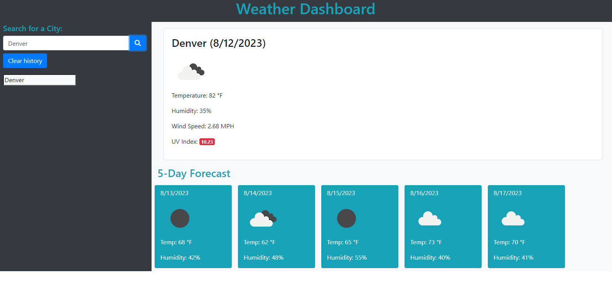

# Weather Dashboard
This Weather Dashboard is an interactive web application that allows users to retrieve current weather data and a 5-day forecast for any city. With a focus on clean design and user-friendliness, the Weather Dashboard ensures users are always just one click away from comprehensive weather updates.
## Table of Contents:
- [Deployment](#deployment)
- [Features](#features)
- [User Story](#user-story)
- [Acceptance Criteria](#acceptance-criteria)
- [Installation](#installation)
- [Usage](#usage)
- [Built With](#built-with)
- [Contributing](#contributing)
- [License](#license)
- [Acknowledgements](#acknowledgements)

## Deployment
[Checkout the Weather Dashboard](https://trace-martin.github.io/weather-dashboard/)
## Preview

## Features
1) <b>Current Weather Data:</b> Fetches and displays the following for the searched city:

* City name and date
* Weather icon representing current conditions
* Temperature in Fahrenheit
* Humidity in percentage
* Wind speed in MPH
* UV Index with color-coded severity indication
2) <b>5-Day Forecast:</b>

* Date
* Weather icon
* Temperature in Fahrenheit
* Humidity in percentage
3) <b>Search History:</b> Keeps track of previous searches which can be  clicked on for quick views.

4) <b>Responsive Design:</b> Adapts well to both mobile and desktop views.
## User Story

```
AS A traveler
I WANT to see the weather outlook for multiple cities
SO THAT I can plan a trip accordingly
```

## Acceptance Criteria

```
GIVEN a weather dashboard with form inputs
WHEN I search for a city
THEN I am presented with current and future conditions for that city and that city is added to the search history
WHEN I view current weather conditions for that city
THEN I am presented with the city name, the date, an icon representation of weather conditions, the temperature, the humidity, and the wind speed
WHEN I view future weather conditions for that city
THEN I am presented with a 5-day forecast that displays the date, an icon representation of weather conditions, the temperature, the wind speed, and the humidity
WHEN I click on a city in the search history
THEN I am again presented with current and future conditions for that city
```

## Installation
1) Clone the repository:
```
git clone <repository_link>
```
2) Navigate to the cloned directory.

3) Open the index.html file in a web browser.

## Usage
1) Enter the name of the city in the "Search for a City" input box.
2) Click the search icon.
3) View the current weather data for the city as well as a 5-day forecast.
4) Your search will be saved in the "Search History". Click on any city in the history to view its weather data again.
5) To clear the search history, click on the "Clear history" button.
## Built With
* HTML
* JavaScript
* Bootstrap 4.3.1
* Axios
* OpenWeatherMap API
## Contributing
1) Fork the repository.
2) Create a new branch (git checkout -b feature-branch-name).
3) Make your changes.
4) Commit the changes (git commit -m 'Add a feature').
5) Push the branch (git push origin feature-branch-name).
6) Submit a pull request.
## License
This project is licensed under the MIT License - see the LICENSE.md file for details.

## Acknowledgements
OpenWeatherMap for providing the weather data and icons.